```{r setup, include=FALSE}
knitr::opts_chunk$set(echo = FALSE, include = FALSE, cache = TRUE, message =FALSE, warning = FALSE)

```

```{r, cache=FALSE}
library(ggplot2)
library(corrplot)
library(Hmisc)
library(cowplot)
library(gridExtra)
library(rcompanion)
library(dplyr)
library(MASS)
library(DHARMa)
library(lmtest)
library(glmtoolbox)
library(AER)
library(lmtest)
library(kableExtra)
library(modelsummary)

source("./utils__.R")
FONT_SIZE = 5
kable <- function(...) {
   knitr::kable(...) %>% kable_styling(font_size = FONT_SIZE) %>% kable_paper(full_width = F)%>% kable_styling(position = "float_right")
}
```

```{r read data}
dir <- getwd()

df <- read.csv(paste0(dir,"/spotify_tracks_15_16_filtered.csv"))
```

```{r data cleaning}
df <- df[df$num_of_artists<6,]
```


```{r feature engineering_1}
non_important_cols <- c("id", "id_artists", "genre")
categorical_feat <- c("explicit", "key", "mode", "time_signature", "year")
continus_feat <- names(df)[!(names(df) %in% categorical_feat)]
continus_feat <- continus_feat[!(continus_feat %in% c("release_date", "artists", "name"))]
df <- df[, !(names(df) %in% non_important_cols)]
columns_to_rescale <- c("danceability", "energy", "loudness", "speechiness", "acousticness", "instrumentalness", "liveness", "valence","artist_popularity")
```

```{r feature_engineering_2}
df$duration_min <- round(df$duration_ms/60000,2)
df <- dplyr::select(df, -c(duration_ms))
df$release_date <- as.Date(df$release_date)
df[categorical_feat] <- lapply(df[categorical_feat], factor)
df <- na.omit(df)
df$release_date_ms <- as.numeric(as.POSIXct(df$release_date)) * 1000
df[columns_to_rescale] <- lapply(df[columns_to_rescale], rescale_0_to_10)
df$is_popular <- df$popularity>=20
df$is_popular_v2 <- ifelse(df$popularity>=20, "popular", "not_popular")
df_only_popular <- df[df$is_popular,]


```

## Introduction

Spotify is one of the world's leading music streaming platforms, with a vast library of songs from various genres and artists. 
To enhance the user experience and provide personalized recommendations, Spotify uses a combination of user behavior data and audio feature analysis.
In this paper, I'm trying to model how a certain song become popular. I've chose the data-set [Spotify tracks dataset](https://www.kaggle.com/datasets/lehaknarnauli/spotify-datasets?ref=datascience.fm&select=tracks.csv), which consist hundred of thousands of songs which can be describe by mostly audio features.

### Dataset
The provided data-set contains ~250,000 songs that was composed between 1950-2020.
For working with a smaller data-set, I've cleaned the data-set to include songs that answer the following rules:\ 
1. Composed between the years 2015-2016.
2. Only English songs.
3. Remove songs with popularity equal to 0.

New data-set size: 15,206 songs.

I've enriched the data-set with some more features with the Spotify API:
Artist_popularity - how popular is the artist.
Genre - Genre of this particular artist (i took a random genre because each artist have multiple genres).
Artist_followers.


### Problem statement
The problem I will try to solve is to predict the popularity of a song, based on a set of mostly audio features.
We can model this problem as $P(Y|X)$ when $Y=Popularity$, $X=Features$.
Except from predictability, we can use $P(Y|X)$ for understanding how the model features influence on our target variable.

Our target variable is the popularity of each song. $Y$ is continuous variable (from 0 to 100). For modeling the logistic model, i will introduce another target variable ($is_{popular}$), which have a binary outcome.
The cutoff point will be at popularity=20.


```{r popularity_hist_save, include=TRUE}
p <- ggplot(df, aes(x = popularity)) +
  geom_histogram(bins = 100, fill = "lightblue", color = "black") +
  geom_vline(xintercept = 20, color = "red", linetype = "dashed") +
  labs(x = "Popularity", y = "Frequency", title = "Histogram of Popularity") +
  theme_minimal()
ggsave("spotifyGLM/plots/popularity_hist.png", plot = p, width = 6, height = 4)


```

```{r popularity_hist_show, echo=FALSE, out.width = '50%', include=TRUE}
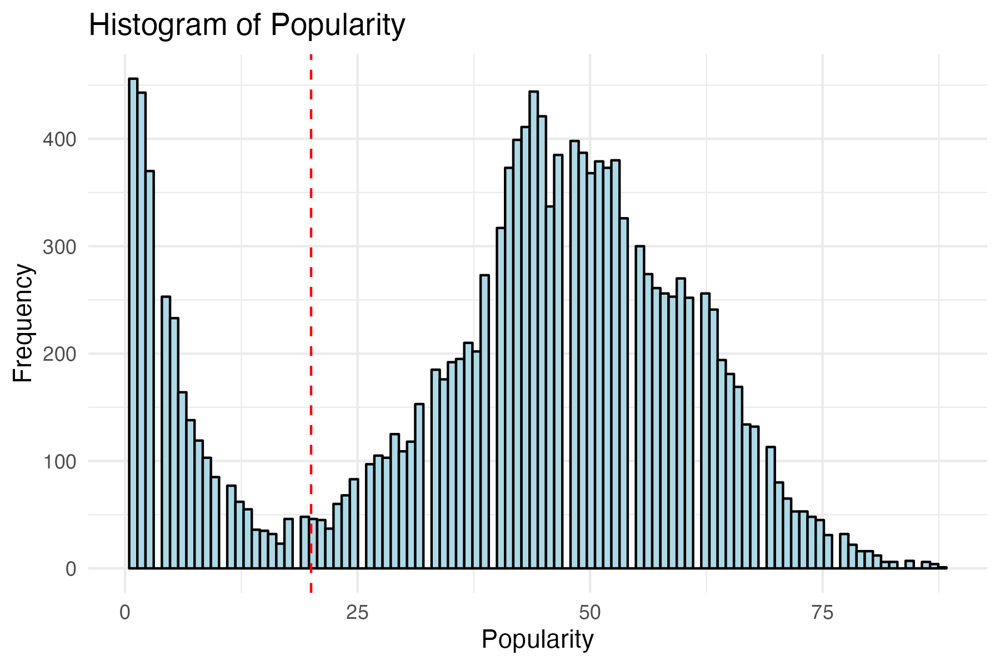
```


### EDA

```{r all_feat_hist_show, echo=FALSE, out.width = '100%',fig.cap='ALl features histograms', include=TRUE, fig.align = 'center'}
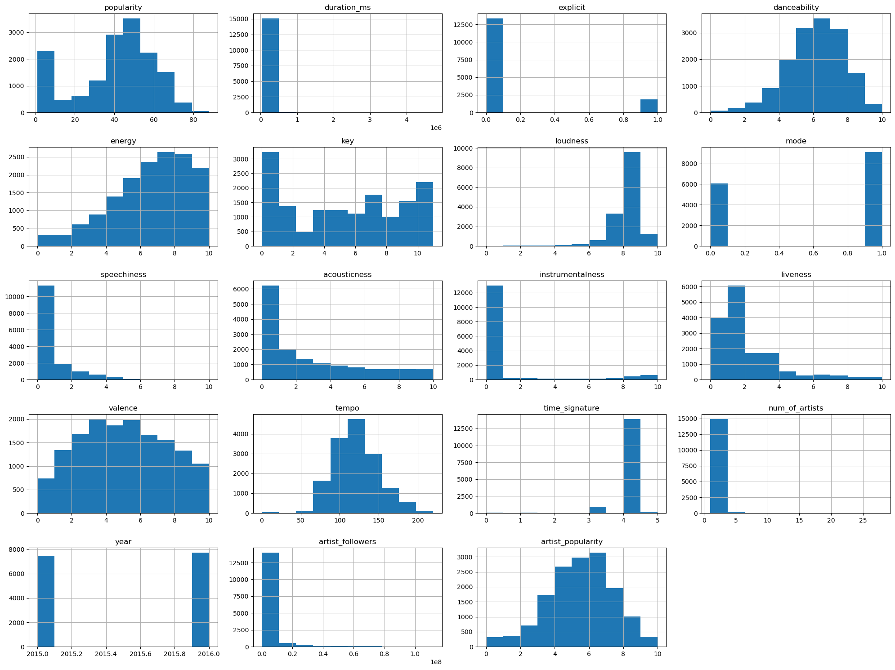
```

- We can cluster the continuous variables distribution into two main groups: normal or power law.
- The energy feature seems to distributed exponentially.
- We have pretty much the same amount of songs between 2015 and 2016.
- Most of the songs does not contains explicit content.
- We have some outlines in num_of_artists, duration_ms.

```{r KDE, include=TRUE}


# Function to create KDE plot for a given variable
create_kde_plot <- function(data, var_name) {
  data <- data %>%
    mutate(is_popular_group = ifelse(is_popular == 1, "Popular", "Not Popular"))

  ggplot(data, aes(x = !!as.name(var_name), fill = is_popular_group)) +
    geom_density(alpha = 0.5) +
    labs(
         x = var_name,
         y = "Density") +
    theme_minimal()
}

# List of columns to plot (excluding 'is_popular')
cols_to_plot <- c("danceability", "energy", "acousticness", "liveness", "valence", "tempo")


# Create a list to store the plots
plots_list <- list()

# Create KDE plots for each variable in the data-set
for (col in cols_to_plot) {
  plot_data <- df[, c(col, "is_popular")]
  plot <- create_kde_plot(plot_data, col)
  plots_list <- c(plots_list, list(plot))
}

# Arrange and print the plots
grid.arrange(grobs=plots_list,ncol = 2, top="KDE plots (popular vs not popular)")

```

Here is a plot of the KDE of some interesting continues features. $KDE(X|Y=1)$, $KDE(X|Y=0)$ (Gaussian kernel), when $X$ is a certain feature and $Y=is\_popular$.
we want to see features that act very different with popularity and without popularity. 
We can see that songs with lower energy tend to be more popular.
seems that ~130 tempo is very not popular. 
Popular songs tend to be less live, with more valence and more danceable. 


```{r mean_popularity_by_genre, echo=FALSE, fig.cap="", out.width = '55%', fig.align = 'center'}
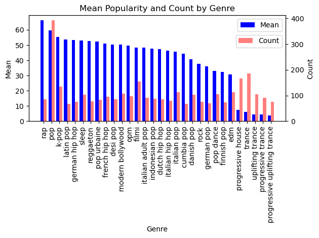

```


```{r corr, include=FALSE, eval=FALSE}
numeric_df <- df[, sapply(df, is.numeric)]
cor_matrix <- cor(numeric_df)
corrplot(cor_matrix, type = "upper", order = "hclust", 
         tl.col = "black", tl.srt = 45)
ggsave("spotifyGLM/plots/corr.png")
```
```{r corr_show, echo=FALSE, fig.cap="", out.width = '55%'}
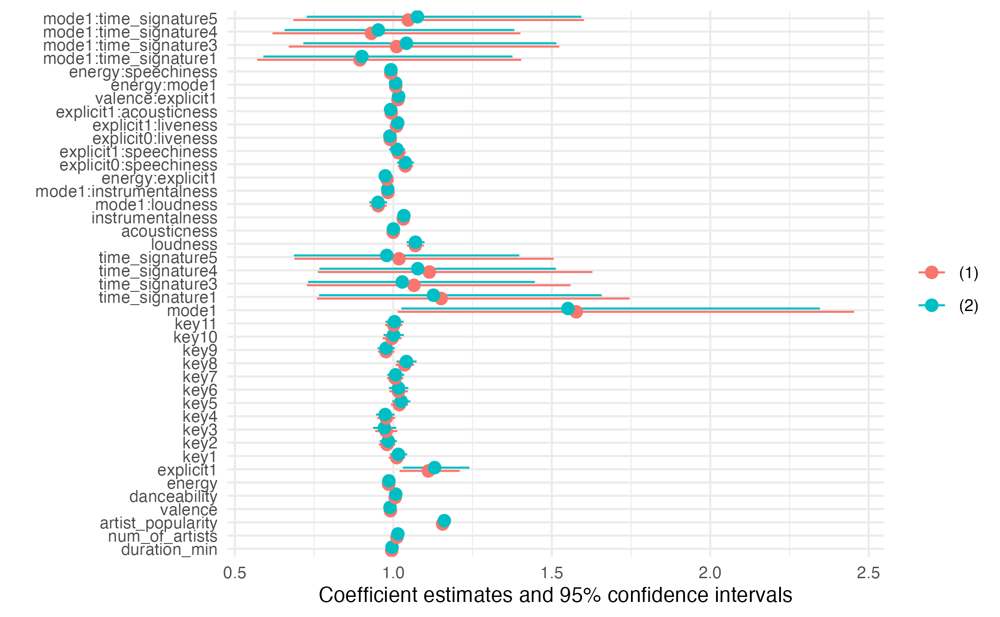

```
Some features with positive correlation with popularity:danceability, loudness, artist_followers.
Negative correlation: instrumentales, energy, liveness.
There some highly correlated features such as energy-loudness, danceability-valence, danceability-instrumentales, loudness-instrumentales, acousticness-energy (neg).

```{r high_correlated_feat,include=TRUE, message=FALSE}
plot_correlation <- function(df, col_a, col_b, col_c) {
  col_a_ <- sym(col_a)
  col_b_ <- sym(col_b)
  col_c_ <- sym(col_c)

  p <- ggplot(df, aes(x = !!col_a_, y = !!col_b_, color = !!col_c_)) +
    geom_point(alpha=0.5, size=0.2) +
    geom_smooth(method = "lm", se = FALSE, linewidth=0.5) +
    ggtitle(paste(col_b, " vs ", col_a)) +
    
    theme_minimal()
  
  return(p)
}

plots_list <- list()
pairs_vector <- c("energy-loudness", "danceability-valence", "danceability-instrumentalness", 
                   "acousticness-energy")

# Iterate over each pair
for (pair in pairs_vector) {
  cols <- strsplit(pair, "-")[[1]]
  col_a <- cols[1]
  col_b <- cols[2]
  
  p = plot_correlation(df, col_a, col_b, "is_popular")
  plots_list <- c(plots_list, list(p))
}

grid.arrange(grobs = plots_list, ncol = 2)

```

Strong positive correlations exist between loudness and energy, as well as between valence and danceability. acoustic songs are less energetic than non-acoustic ones. Popular songs often score high in instrumentalness songs. Outliers in the loudness vs. energy plot may represent energy but not very loud songs, which are most from white noise and sleep music.


```{r cat_feat analysis, include=TRUE}

categorical_feat <- c("explicit", "key", "mode", "time_signature", "year")


results_df <- data.frame(
  Categorical_Feature = character(),  # Name of the categorical feature
  Chi_Square_Statistic = numeric(),   # Chi-square statistic
  P_Value = numeric()                # P-value of the chi-square test
)


for (feat in categorical_feat) {
  cross_tab <- table(df$is_popular, df[[feat]])
  chi_sq_result <- chisq.test(cross_tab)
  results_df <- rbind(results_df, 
                       data.frame(
                         Categorical_Feature = feat,
                         Chi_Square_Statistic = chi_sq_result$statistic,
                         P_Value = chi_sq_result$p.value
                       )
  )
}

# Print the results
results_df <- results_df[order(results_df$P_Value), ]

kable(results_df)
```

I used chi-square test for our categorical variables, except from the year, seems that all of the categorical variables will be important in our modeling.


```{r caterorical_feat_w_popularity}
plots_list <- c()
create_barplot_count <- function(data, col) {
  col <- sym(col)
  p <- ggplot(data, aes(x = !!col, fill = !!col)) +
    geom_bar() +
    scale_fill_discrete()  # This will use different colors for each category
  
  return(p)
}
create_violon_plot <- function(data, col) {
  col <- sym(col)
  p <- ggplot(data, aes(x = !!col, y = popularity, color=!!col)) +
    geom_violin() 
  
  return(p)
}

# Iterate over each column in categorical_feat and create colorful violin plots and bar plots of count
for (col in c("explicit", "time_signature")) {
  # Create colorful violin plot
  
  # Create bar plot of count
  bar_plot <- create_barplot_count(df, col)
  violin_plot <- create_violon_plot(df,col)
  plots_list <- c(plots_list, list(bar_plot), list(violin_plot))
}

```

```{r caterorical_feat_w_popularity_plot}

# Arrange the plots in a grid
grid.arrange(grobs = plots_list[1:4], ncol = 2)  # Adjust ncol ac
```

As we already seen, explicit songs tend to be much more popular (and less common).
Songs with 0 time_signature are mostly songs for meditation etc. Most of the songs in the world
are with time_signature = 4. I think that this variable could be more interesting with 
interactions.


```{r loudness_energy_acusticness, include=FALSE}
  colors = c("#5e4fa2", "#3288bd", "#66c2a5", 
           "#abdda4", "#e6f598", "#fee08b", 
           "#fdae61", "#f46d43", "#d53e4f", 
           "#9e0142")
ggplot(df,
       aes(x=loudness, y=popularity, size = energy, color = acousticness)) +
geom_point(alpha = 0.1, shape = 21) +
scale_size(range = c(1, 5)) +
scale_colour_gradientn("Acousticness", colours = colors) +
geom_point(position=position_jitter(w = 0.0, h = 0.8),alpha=0.85) +
xlab('Loudness') +
ylab('Popularity')
```


#### EDA summary

Categorical variables (except year) crucial for modeling. Explicit songs more popular but less common. Time signature 0 for meditation, 4 most prevalent. Potential interactions in time signature.

Explicit content links to higher popularity, despite rarity. There are variability between popular and non-popular songs: lower energy, different tempo, slight higher valence, higher danceability and artist followers mark more popularity.

There are some very strong features that could help us to model our problem by their own, while there are a lot of potential interaction between some of the variables (mainly the categorical variables such as explicit, mode and key). For example, the mode categorical variable is defining if the song will in a minor scale (sad) or major scale (happy), the interaction with all of the audio features is really important for which king of song it will be.

Some interesting facts:

1. The artist with most of the songs in this time period is [Roy & Alex Orbison & Chuck Turner](https://open.spotify.com/album/5l6AFjM8OaWnshRe0Pu4qj?si=WBOK2K_6Td-3DKh0iDp_vQ) with 133 songs! (Remastered...)
The artist that really have a lot of songs in this period are [BTS](https://open.spotify.com/artist/3Nrfpe0tUJi4K4DXYWgMUX?si=tDJY130kRJiSmgx9Pw7Frw) with 90 songs. I don't know them, but seems they got famous with the help of Coldplay.


```{r}
top_artists <- df %>%
  group_by(artists) %>%
  summarize(total_songs = n()) %>%
  arrange(desc(total_songs)) %>%
  head()

print(top_artists)
```
2. The most popular song is [goosebumps](https://open.spotify.com/track/6gBFPUFcJLzWGx4lenP6h2?si=e60257b709134a74) by Travis scott.
```{r}
ll <- data.frame()
feat <- c('popularity','danceability', 'energy', 'loudness', 'speechiness', 'acousticness', 'instrumentalness', 'valence', 'tempo', 'num_of_artists')
for (f in feat) {
  m = df[which.max(df[,f]),]  
  ll <- rbind(ll, m)
}
ll$which.max <- feat
ll[,c("which.max","name","artists")]
```

3. The loudest song is [Let Me Hear](https://open.spotify.com/track/5sqkarfxe7UejHTlCtHCLS?si=568b204a44c04fd6) by Fear, and Loathing in Las Vegas. (You can guess which genre)

4. The most danceable song is [Hudiny](https://open.spotify.com/track/5gcKqaXjgmqX6EUeQA0H5d?si=d811c369d96f415d) by Miro Jaros.

5. The song with the most energy is [Numb The Pain (Mix Cut) - Original Mix](https://open.spotify.com/track/4punrab9NtQ54sNIQNI2Ml?si=2bb4e73068714e81)


## Methods
This section will be organize as follows:
1. General
2. Different metrics ive used
3. Different formulas ive used
4. Different models ive used

To model the popularity of a song we can model it as a regression problem (how popular is the song), and as classification problem (is the song popular or not). \
I will focus in 3 main models: \
1. Poisson model. \
2. Gamma-Poisson model (negative binomial). \
3. logistic model (different link functions). \

For the regression models I'm dealing only with popular songs (songs with popularity>20), for easy reference of the target variable, the new Y is Popularity-20.
### Metrics
For comparing between models I've used a few main metrics: \
1. **AIC** - The Akaike Information Criterion (AIC) is a statistical measure used for model selection and comparison. It balances the trade-off between the goodness of fit of a model and its complexity, aiming to find the most suitable model for a given data-set. AIC is defined as: $AIC = 2k - 2\ln(L)$ Where:
$k$ represents the number of parameters in the model.
$L$ is the maximum likelihood estimate of the likelihood function for the model.
The lower the AIC value, the better the model fits the data while penalizing for increased complexity. Thus, models with lower AIC values are generally preferred when comparing different models.

2. **BIC** - The Bayesian Information Criterion (BIC), also known as the Schwarz criterion, is a statistical measure used for model selection and comparison. Like AIC, it aims to balance model goodness of fit and complexity. BIC incorporates a penalty for model complexity that is stricter than AIC. BIC is defined as:
$BIC = k \ln(n) - 2\ln(L)$
Where:
$k$ represents the number of parameters in the model.
$n$ is the number of observations in the data-set.
$L$ is the maximum likelihood estimate of the likelihood function for the model.
Similar to AIC, lower BIC values indicate a better trade-off between fit and complexity. However, BIC tends to penalize complex models more heavily due to the $k \ln(n)$ term, making it a more conservative choice in model selection.

3. **Deviance** - Deviance is a measure used to assess the goodness of fit of the model. It quantifies the difference between the observed data and the model's predictions. Deviance is defined as:
$$ \text{Deviance} = -2 \times (\ln(L_{\text{null}}) - \ln(L_{\text{model}})) $$
Where:
- $L_{\text{null}}$ is the likelihood of a null or intercept-only model.
- $L_{\text{model}}$ is the likelihood of the fitted GLM.
Deviance is a way to compare the fit of a model to the fit of a saturated model that perfectly fits the data. The lower the deviance value, the better the model fits the data. We can also compare models with different features inside and not the null.


4. **LRT test** - The Likelihood Ratio Test (LRT) is a statistical test used to compare the fit of two nested models. It assesses whether adding or removing certain parameters in a model significantly improves or worsens the model fit. The test statistic for LRT is based on the difference in log-likelihoods between the two models and follows a chi-squared distribution.
Given two models, the larger (more complex) model is denoted as \( M_1 \) and the simpler, nested model as \( M_0 \). The LRT statistic is calculated as:
$$ \text{LRT} = -2 \times (\ln(L_{M_0}) - \ln(L_{M_1})) $$
Where:
- $L_{M_0}$ is the likelihood of the nested model $M_0$.
- $L_{M_1}$ is the likelihood of the larger model $M_1$.

The LRT statistic can be compared to the chi-squared distribution with degrees of freedom equal to the difference in the number of parameters between the two models. If the calculated LRT statistic is larger than the critical value from the chi-squared distribution, it indicates that the larger model significantly improves the fit compared to the nested model.


All of the models that i will fit are fully parametric. As a result, a likelihood ratio test (LR) is a simple way for distinguishing between models. When models are nested, the LR statistic has the standard $\chi^2$ distribution. The non formal strategy for non-nested models is to employ information criteria such as the Akaike information criterion (AIC).

### Formulas
I've used a few formulas that seems reasonable based on the EDA and sort-of-domain-knowledge, the models are nested such that the bigger model contains all of the smaller models. I will use backward elimination for removing unwanted features from the most complex model.

**Formula 1**
The most basic features I had in mind: 
The duration of the song - i assume that most of the people love to hear songs that are not too long and too short.
The artist popularity sounds very reasonable feature.
Valence is how 'positive' is the song which sound to me as a good feature.
Two audio features which also sounds reasonable to explain popularity (based on correlation).
From the EDA, explicit and key was very promising leads.
$$popularity \sim  duration\_min + num\_of\_artists + artist\_popularity + valence \\+ danceability + energy + explicit + key$$
**Formula 2**
Here I've added some more musical features such as  mode, time signature and tempo which should explain the musical properties of the songs.
$$popularity \sim formula\_1 + mode + time\_signature + tempo +loudness$$
**Formula 3**
Here I've added 2 more audio features, and a few interactions:
The mode of the song is pretty useless without features like loudness+instrumentalness +energy. There is a big difference between a sad song with high energy and a sad song with low energy.
Similarly, the explicit can also have interesting interactions. Think about a very positive song with explicit content, vs positive song with non-explicit content.

$popularity \sim formula\_2 +acousticness+instrumentalness+mode:(loudness+instrumentalness +energy+time \ signature)+\\explicit:(energy+speechiness+liveness+acousticness+valence)+energy:speechiness$


### Models
#### Poisson
the GLM likelihood equations for $n$ independent observations simplify for a Poisson response with linear predictor $\eta_{i}=g\left(\mu_{i}\right)=\sum_{j} \beta_{j} x_{i j}$ having link function $g$ to

$$
\sum_{i=1}^{n} \frac{\left(y_{i}-\mu_{i}\right) x_{i j}}{\operatorname{var}\left(y_{i}\right)}\left(\frac{\partial \mu_{i}}{\partial \eta_{i}}\right)=\sum_{i=1}^{n} \frac{\left(y_{i}-\mu_{i}\right) x_{i j}}{\mu_{i}}\left(\frac{\partial \mu_{i}}{\partial \eta_{i}}\right)=0 .
$$
Although a GLM can model a positive mean using the identity link, it is more common to model the log of the mean. Like the linear predictor, the log mean can take any real value. The log mean is the natural parameter for the Poisson distribution, and the log link is the canonical link for a Poisson GLM. The Poisson loglinear model is
$$
\log \mu_{i}=\sum_{j=1}^{p} \beta_{j} x_{i j}, \quad \text { or } \quad \log \boldsymbol{\mu}=\boldsymbol{X} \boldsymbol{\beta}
$$
in terms of a model matrix and model parameters. For $\eta_{i}=\log \mu_{i}, \partial \mu_{i} / \partial \eta_{i}=\mu_{i}$, so the likelihood equations are
$$
\sum_{i}\left(y_{i}-\mu_{i}\right) x_{i j}=0
$$
For a Poisson loglinear model, the mean satisfies the exponential relation
$$
\mu_{i}=\exp \left(\sum_{j=1}^{p} \beta_{j} x_{i j}\right)=\left(e^{\beta_{1}}\right)^{x_{i 1}} \cdots\left(e^{\beta_{p}}\right)^{x_{i p}} .
$$
A 1-unit increase in $x_{i j}$ has a multiplicative impact of $e^{\beta_{j}}$ : the mean at $x_{i j}+1$ equals the mean at $x_{i j}$ multiplied by $e^{\beta_{j}}$, adjusting for the other explanatory variables. \
Note that the Poisson deviance:
$$
D(\boldsymbol{y}, \hat{\boldsymbol{\mu}})=2 \sum_{i}\left[y_{i} \log \left(\frac{y_{i}}{\hat{\mu}_{i}}\right)-y_i+\hat{\mu_i} \right]\rightarrow_{log\_link}=2 \sum_{i}\left[y_{i} \log \left(\frac{y_{i}}{\hat{\mu}_{i}}\right)\right] .
$$

Taken from [@agresti2015foundations]

For estimation of the dispersion parameter I've used the formula with the default pearson estimator:
$$\phi_P = \frac{X^2}{n-k}=\frac{1}{n-k}\sum_{i=1}^n \frac{w_i (y_i - \hat{\mu}_i)^2}{ v(\hat{\mu}_i)}$$

There are several ways to deal with over-dispersion in poisson Glm - using Quasipoisson distribution / gamma distribution / negative binomial distribution.

I chose to use the negative binomial model. Actually, asymptotically, the NB model will aim to the poisson model as the $r$ parameter goes to infinity. A short explaination from [Tim Barry](https://timothy-barry.github.io/posts/2020-06-16-gamma-poisson-nb/): \
Consider the negative binomial (NB) distribution, represented as \(P(X = x) = \binom{x + r - 1}{x} \cdot \left(\frac{p}{p+r}\right)^x \cdot \left(\frac{r}{p+r}\right)^r\). Its mean is calculated as \(\frac{p/(p+r)r}{1 - p/(p+r)} = p\), and its variance is given by \(\frac{ p/(p+r) r }{ (1 - p/(p+r))^2 } = p + \frac{p^2}{r}.\) \
Hence, when \(r<\infty\), the variance of the negative binomial distribution surpasses its mean. This distinctive feature sets the Poisson and NB distributions apart—while in the Poisson distribution, the mean and variance align. Demonstrably, as \(r\) approaches infinity, the NB distribution converges to the Poisson distribution. In simpler terms, as \(r\) becomes exceptionally large, \(\lim_{r \to \infty} \textrm{NB}\left( r, \frac{\lambda}{r + \lambda}\right) = \textrm{Pois}(\lambda).\) 
Thus, for substantial \(r\), the NB and Poisson distributions can be treated as essentially identical. On the other hand, for small \(r\), the NB distribution assumes a form resembling an "over-dispersed" Poisson distribution.
[@barry2020gamma].

For the negative binomial, I've fitted the same model as the poisson, but this time with negative binomial model (with log link), and will compare the two.

#### Negative binomial

A mixture model is a flexible way to account for over-dispersion. At a fixed setting of the explanatory variables actually observed, given the mean $\lambda$, suppose the distribution of $y$ is Poisson $(\lambda)$, but $\lambda$ itself varies because of unmeasured covariates. Let $\mu=E(\lambda)$. Then unconditionally,

$$
\begin{gathered}
E(y)=E[E(y \mid \lambda)]=E(\lambda)=\mu, \\
\operatorname{var}(y)=E[\operatorname{var}(y \mid \lambda)]+\operatorname{var}[E(y \mid \lambda)]=E(\lambda)+\operatorname{var}(\lambda)=\mu+\operatorname{var}(\lambda)>\mu .
\end{gathered}
$$

Here is an important example of a mixture model for count data: suppose that (1) given $\lambda, y$ has a Poisson $(\lambda)$ distribution, and (2) $\lambda$ has the gamma distribution. Recall that the gamma distribution has $E(\lambda)=\mu$ and $\operatorname{var}(\lambda)=\mu^{2} / k$ for a shape parameter $k>0$, so the standard deviation is proportional to the mean. Marginally, the gamma mixture of the Poisson distributions yields the negative binomial distribution for $y$. Its probability mass function is

$$
p(y ; \mu, k)=\frac{\Gamma(y+k)}{\Gamma(k) \Gamma(y+1)}\left(\frac{\mu}{\mu+k}\right)^{y}\left(\frac{k}{\mu+k}\right)^{k}, \quad y=0,1,2, \ldots .
$$

With $k$ fixed, this is a member of an exponential dispersion family appropriate for discrete variables, with natural parameter $\log [\mu /(\mu+k)]$.
In the two-parameter negative binomial family, let $\gamma=1 / k$. Then $y$ has
$$
E(y)=\mu, \quad \operatorname{var}(y)=\mu+\gamma \mu^{2} .
$$
The index $\gamma>0$ is a type of dispersion parameter. The greater the value of $\gamma$, the greater the over-dispersion relative to the Poisson. As $\gamma \rightarrow 0$, $\operatorname{var}(y) \rightarrow \mu$ and the negative binomial distribution converges to the Poisson.

The negative binomial distribution has much greater scope than the Poisson. For example, the Poisson mode is the integer part of the mean and equals 0 only when $\mu<1$. The negative binomial is also uni modal, but the mode is 0 when $\gamma \geq 1$ and otherwise it is the integer part of $\mu(1-\gamma)$. The mode can be 0 for any $\mu$.

Negative binomial GLM's commonly use the log link, as in Poisson loglinear models, rather than the canonical link. 
The likelihood equations obtained by differentiating $L(\boldsymbol{\beta}, \gamma ; \boldsymbol{y})$ with respect to $\boldsymbol{\beta}$ have the form: 

$$
\sum_{i=1}^{n} \frac{\left(y_{i}-\mu_{i}\right) x_{i j}}{\operatorname{var}\left(y_{i}\right)}\left(\frac{\partial \mu_{i}}{\partial \eta_{i}}\right)=\sum_{i} \frac{\left(y_{i}-\mu_{i}\right) x_{i j}}{\mu_{i}+\gamma \mu_{i}^{2}}\left(\frac{\partial \mu_{i}}{\partial \eta_{i}}\right)=0, \quad j=1,2, \ldots, p
$$

The deviance for a negative binomial GLM is

$$
D(\boldsymbol{y}, \hat{\boldsymbol{\mu}})=2 \sum_{i}\left[y_{i} \log \left(\frac{y_{i}}{\hat{\mu}_{i}}\right)-\left(y_{i}+\frac{1}{\hat{\gamma}}\right) \log \left(\frac{1+\hat{\gamma} y_{i}}{1+\hat{\gamma} \hat{\mu}_{i}}\right)\right] .
$$

This is close to the Poisson GLM deviance when $\hat{\gamma}$ is near 0. [@agresti2015foundations]

The model selection was done in a similar way to the poisson model selection.
For comparing between the poisson and the NB model i compared their AIC, BIC and scaled deviance. This comparison is not that informal, so I've made a simple analysis of the pearson residuals of those two models.


#### Logistic regression
In this section, i will handle this problem as a classification problem when $Y=is \ popular$.
The threshold for what popular is will be the same as the previous section ($is \ popular = popularity \geq 20$).


todo explanation about logistic regression.

<!-- Comparing to the regression models is problematic, because this is a different problem. I've compare the impact of the coefficients for each model. Because there are different link functions, I thought about comparing the ranking and significance of the coefficients. -->

<!-- Let $\beta_{M_1} = (\beta_{1,1}, \beta_{1,2}, \ldots, \beta_{1,p})$ and $\beta_{M_2} = (\beta_{2,1}, \beta_{2,2}, \ldots, \beta_{2,p})$ be the coefficient vectors for models $M_1$ and $M_2$ respectively, where $n$ is the number of coefficients. -->

<!-- To compare the similarity of the coefficient ranking between the two models, one approach is to calculate a ranking correlation coefficient, such as the Spearman's rank correlation coefficient ($\rho$), given by: -->

<!-- \[ -->
<!-- \rho = 1 - \frac{6 \sum d_i^2}{n(n^2 - 1)} -->
<!-- \] -->
<!-- where $d_i$ is the difference in ranks of $\beta_{1,i}$ and $\beta_{2,i}$. -->


The link function in logistic regression is a mathematical function that transforms the linear predictor (a linear combination of the independent variables) to a probability. The most common link functions used in logistic regression are the logit, probit, and loglog link functions.

*Logit link function*: The logit link function is the most common link function used in logistic regression. It is defined as the natural logarithm of the odds of success. The odds of success is the probability of success divided by the probability of failure. The formula for the logit link function is:

$logit(\mu) = \ln \left( \frac{\mu}{1 - \mu} \right)$
where $\mu$ is the mean of the probability distribution.


*Probit link function*: The probit link function is another common link function used in logistic regression. It is defined as the inverse of the cumulative distribution function (CDF) of the standard normal distribution. The CDF of the standard normal distribution is a function that takes a real number as input and returns the probability that a standard normal random variable will be less than or equal to that number. The formula for the probit link function is:
$probit(\mu) = \Phi^{-1}(\mu)$
where $\Phi$ is the CDF of the standard normal distribution.

Loglog link function: The loglog link function is a less common link function used in logistic regression. It is defined as the logarithm of the odds of success multiplied by 2. The formula for the loglog link function is:
$loglog(\mu) = 2 \ln \left( \frac{\mu}{1 - \mu} \right)$


I will compare different log functions for the logistic regression: 
I've compared different logit, probit, loglog by ROC, BIC, AIC and deviance.
The Receiver Operating Characteristic (ROC) curve is a graphical representation used to assess the performance of classification models, particularly in binary classification tasks. It illustrates the trade-off between the True Positive Rate (Sensitivity) and the False Positive Rate (1 - Specificity) across different threshold values for predicting the positive class.

The ROC curve is constructed by plotting the True Positive Rate (TPR) against the False Positive Rate (FPR) as the threshold for classifying positive instances is varied.


### GMM TODO
I will fit a Generalized Linear Mixed Model (GLMM), where the target variable is whether a track is popular (`is\_popular`). I'm using the binomial family to model the binary outcome. The model includes a random effect to account for clustering by the artist variable. The GLMM can be represented as:

\[
\text{logit}(P(\text{is\_popular})) = \beta_0 + \beta_1 \times \text{duration\_min} + \beta_2 \times \text{num\_of\_artists} + \ldots + \beta_k \times \text{energy:mode1} + \alpha_{\text{artist}}
\]

where:
\begin{align*}
P(\text{is\_popular}) & \text{ is the probability of a track being popular}, \\
\beta_0 \text{ to } \beta_k & \text{ are the fixed effect coefficients for the predictor variables}, \\
\alpha_{\text{artist}} & \text{ represents the random effect for each artist}, \\
\text{Other predictor variables} & \text{ are as described in your model output.}
\end{align*}

*I will filter the data so only artists that have more than 2 songs in those years will be counted due too many artists clusters.


## Results

```{r formulas}
df_only_popular <- df[df$is_popular,]
df_only_popular$popularity <- df_only_popular$popularity-20

formula_1_  <- "duration_min + num_of_artists + artist_popularity + valence + danceability + energy+explicit + key "
formula_2_  <- paste(formula_1_," + mode + time_signature + tempo   +loudness")
#note: I've tried to use offset(log(relase_date)) but the models was better without.
formula_3_ <- paste(formula_2_," +acousticness+instrumentalness+mode:loudness + mode:instrumentalness +explicit:energy+explicit:speechiness +explicit:liveness+explicit:acousticness +explicit:valence+energy:mode+energy:speechiness+mode:time_signature")

formula_1 <- as.formula(paste("popularity ~ ", formula_1_))
formula_2 <- as.formula(paste("popularity ~ ", formula_2_))
formula_3 <- as.formula(paste("popularity ~ ", formula_3_))
formulas <- c(formula_1, formula_2,formula_3)

```

```{r models}
nb_models = c()
poisson_models = c()
lm_models = c()

for (f in formulas){
  
  nb_model <- glm.nb(data = df_only_popular, formula = f)  
  poisson_model <- glm(data = df_only_popular, formula = f,family = poisson(link = "log"))  
  lm_model <- glm(data = df_only_popular, formula = f,family = gaussian())  
  
  nb_models <- c(nb_models, list(nb_model))
  poisson_models <- c(poisson_models, list(poisson_model))
  lm_models <- c(lm_models, list(lm_model))
}


```

```{r poisson comparison}
comparison_df_poisson_models <- calculate_comparison_df(poisson_models, "poisson_model")
comparison_df_nb_models <- calculate_comparison_df(nb_models, "nb_model")
comparison_df_lm_models <- calculate_comparison_df(lm_models, "lm_model")
anova(poisson_models[[2]],poisson_models[[3]], test = "LRT")

```

### Poisson model
```{r, stepFUnction poisson}


poisson_model <- poisson_models[[3]]
step <- stepCriterion(poisson_model, criterion="p-value", direction="backward", test="lr",  levels = c(0.05, 0.05))
formula_3_reduced = paste("popularity ",step$final)
poisson_model_reduced <- glm(data=df_only_popular, formula=formula_3_reduced, family = poisson(link="log"))

```
I chose the poisson model because we are dealing with count data, the popularity variable is a discrete variable, which seems suitable for this model. Another reason is simplicity. Pretty easy to use, without any special data pre-processing, and easy to interpret.

The main problem with this model is over-dispersion. The Poisson distribution assumes that the mean and variance of the response variable are equal. If the variance is larger than the mean, it indicates over-dispersion. mean of the popularity is very not equal to the variance (mean=`r round(mean(df$popularity),2)`, var=`r round(var(df$popularity),2)`), which could indicate on over-dispersion (but this is not the right measurement for overdispersion).


The LRT test: $2(L(M_2)-L(M_3))$ = 2 X (`r round(logLik(poisson_models[[2]])[1])` - `r round(logLik(poisson_models[[3]])[1])`) = `r round(lrtest(poisson_models[[2]],poisson_models[[3]])[4][[1]][2])` with 1 df.
The p-val is almost 0, which means that the third model is superior.
But this model is a bit complex. I will use search algorithms for making this model a bit leaner.
The backward elimination procedure removed the tempo feature.
The LRT test: $2(L(M_{3\_reduced})-L(M_3))$ with 1 df, yield p-val of `r round(lrtest(poisson_model_reduced,poisson_model)[5][[1]][2],3)`, which means that the complex model is not better, and I can remove the tempo feature (Wald test have similar result). 
I felt it a bit strange that the tempo is not a good feature, and i sample some songs and listened to them in Spotify - and the tempo that we have on the data-set is wrong!

#### Model diagnostics
The final model can be describe with the following formula (there is a package for making this formula! [equatiomatic](https://datalorax.github.io/equatiomatic/):

```{r, cache=FALSE}
library(equatiomatic)
eq_str_ = extract_eq(poisson_model_reduced,wrap = TRUE, terms_per_line = 5, use_coefs = FALSE)

```


$$
\begin{aligned}
\log ({ E( \operatorname{popularity} ) })  &= \alpha + \beta_{1}(\operatorname{duration\_min}) + \beta_{2}(\operatorname{num\_of\_artists}) + \beta_{3}(\operatorname{artist\_popularity}) + \beta_{4}(\operatorname{valence})\ + \\
&\quad \beta_{5}(\operatorname{danceability}) + \beta_{6}(\operatorname{energy}) + \beta_{7}(\operatorname{explicit}_{\operatorname{1}}) + \beta_{8}(\operatorname{key}_{\operatorname{1}}) + \beta_{9}(\operatorname{key}_{\operatorname{2}})\ + \\
&\quad \beta_{10}(\operatorname{key}_{\operatorname{3}}) + \beta_{11}(\operatorname{key}_{\operatorname{4}}) + \beta_{12}(\operatorname{key}_{\operatorname{5}}) + \beta_{13}(\operatorname{key}_{\operatorname{6}}) + \beta_{14}(\operatorname{key}_{\operatorname{7}})\ + \\
&\quad \beta_{15}(\operatorname{key}_{\operatorname{8}}) + \beta_{16}(\operatorname{key}_{\operatorname{9}}) + \beta_{17}(\operatorname{key}_{\operatorname{10}}) + \beta_{18}(\operatorname{key}_{\operatorname{11}}) + \beta_{19}(\operatorname{mode}_{\operatorname{1}})\ + \\
&\quad \beta_{20}(\operatorname{time\_signature}_{\operatorname{1}}) + \beta_{21}(\operatorname{time\_signature}_{\operatorname{3}}) + \beta_{22}(\operatorname{time\_signature}_{\operatorname{4}}) + \beta_{23}(\operatorname{time\_signature}_{\operatorname{5}}) + \beta_{24}(\operatorname{loudness})\ + \\
&\quad \beta_{25}(\operatorname{acousticness}) + \beta_{26}(\operatorname{instrumentalness}) + \beta_{27}(\operatorname{mode}_{\operatorname{1}} \times \operatorname{loudness}) + \beta_{28}(\operatorname{mode}_{\operatorname{1}} \times \operatorname{instrumentalness}) + \beta_{29}(\operatorname{energy} \times \operatorname{explicit}_{\operatorname{1}})\ + \\
&\quad \beta_{30}(\operatorname{explicit}_{\operatorname{0}} \times \operatorname{explicit}_{\operatorname{speechiness}}) + \beta_{31}(\operatorname{explicit}_{\operatorname{1}} \times \operatorname{explicit}_{\operatorname{speechiness}}) + \beta_{32}(\operatorname{explicit}_{\operatorname{0}} \times \operatorname{explicit}_{\operatorname{liveness}}) + \beta_{33}(\operatorname{explicit}_{\operatorname{1}} \times \operatorname{explicit}_{\operatorname{liveness}}) + \beta_{34}(\operatorname{explicit}_{\operatorname{1}} \times \operatorname{acousticness})\ + \\
&\quad \beta_{35}(\operatorname{valence} \times \operatorname{explicit}_{\operatorname{1}}) + \beta_{36}(\operatorname{energy} \times \operatorname{mode}_{\operatorname{1}}) + \beta_{37}(\operatorname{energy} \times \operatorname{energy}_{\operatorname{speechiness}}) + \beta_{38}(\operatorname{mode}_{\operatorname{1}} \times \operatorname{time\_signature}_{\operatorname{1}}) + \beta_{39}(\operatorname{mode}_{\operatorname{1}} \times \operatorname{time\_signature}_{\operatorname{3}})\ + \\
&\quad \beta_{40}(\operatorname{mode}_{\operatorname{1}} \times \operatorname{time\_signature}_{\operatorname{4}}) + \beta_{41}(\operatorname{mode}_{\operatorname{1}} \times \operatorname{time\_signature}_{\operatorname{5}})
\end{aligned}
$$

Its easier to understand the impact of the coefficient with taking exp() for this formula.
Then we will get 
$$
\begin{aligned}
{ \widehat{E( \operatorname{popularity} )} }  &= \operatorname{exp}(2.03 - 0.01(\operatorname{duration\_min}) + 0.01(\operatorname{num\_of\_artists}) + 0.14(\operatorname{artist\_popularity}) - 0.01(\operatorname{valence})\ + \\
&\quad 0.01(\operatorname{danceability}) - 0.01(\operatorname{energy}) + 0.11(\operatorname{explicit}_{\operatorname{1}}) + 0.01(\operatorname{key}_{\operatorname{1}}) +  ...)
\end{aligned}
$$

Model metrics: AIC:`r round(poisson_model_reduced$aic,2)` BIC: `r round(BIC(poisson_model_reduced),2)` Deviance: `r round(poisson_model_reduced$deviance,2)`
Let's take a look on the coefficients of the model:

```{r, include=TRUE, results='asis'}
library(stargazer)

stargazer(poisson_model_reduced, coeftest(poisson_model_reduced, vcov = sandwich::vcovHC), type="latex",header=FALSE, single.row = TRUE, 

          no.space = TRUE, # to remove the spaces after each line of coefficients

          column.sep.width = "3pt", # to reduce column width

          font.size = "tiny", column.labels = c("Poisson", "Poisson robust std") )
```

 

```{r, include=FALSE}
library(tidyverse)
library(broom)
poisson_model_reduced %>%   tidy() %>%
  mutate(
    p.value = scales::pvalue(p.value)
  ) %>% knitr::kable(
    col.names = c("Predictor", "B", "SE", "t", "p"),
    digits = c(0, 3, 3, 2, 3),
    align = c("l", "r", "r", "r", "r")) %>% kable_styling(font_size = FONT_SIZE) %>%  kable_paper(full_width = F)
```

The errors of this model seems heteroskedastic, so ive run the model with robust standard errors.
The most 'strong' co-variates are mode, artist_popularity and explicit. 
Coefficients with very low significant rate: key, time_signature (+interactions), acousticness.
Coefficients with very high significant rate are: explicit:instrumentalness,mode:loudness,valence:explicit,energy:speechiness,explicit:liveness,loudness\
instrumentalness,mode,energy:explicit.
The most significant coef is artist_followers, which not very surprising due to the fact that this is a component in the origin formula of Spotify for how they composing the popularity feature.
We can see that there are some important features that becomes unsignificat with the sandwich method (Pval< 0.001) like mode and explicit.

Let's take and example for a new song that have 0 for all of the variables except from explicit=1, loudness=9
That means the predicted popularity should be: $\hat{Y}=exp(\beta_0+\beta_{7}(\operatorname{explicit}_{\operatorname{1}}) +\beta_{24}(\operatorname{loudness}))=exp(1.958+0.105+9*0.67)+20 = 34.38$
I've added the 20 because i subtract it to 0 before the analysis.
 


```{r}


dispersiontest(poisson_model)
dispersion_param = calculate_dispersion(poisson_model)

```


An important thing, is the over-dispersion of this model.
As we suspected, the poisson model have over-dispersion ($\phi$=`r round(dispersion_param,2)`, Pval<0.001).
As i describe in the [methods](#methods) section, I chose to handle this by applying a Negative - binomial model.

### Negative-binomial
I've chose the same model as the poisson. I've already stated that the comparison between those its a bit problematic.
The DHARMa package transform the residuals of any GL(M)M into a standardized space. Once this is done, we can visually assess / test residual problems such as deviations from the distribution, residual dependency on a predictor, heteroskedasticity or autocorrelation in the normal way.
Fundamental results for ordinary linear models about projections and orthogonality of fitted values and residuals do not hold exactly for GLMs, so using this package can very helpful in terms of GLMS.
let's look in the qqplot that was generated by the DHARMa package:

```{r}
nb_model_reduced <- glm.nb(data=df_only_popular, formula=formula_3_reduced)
anova(poisson_model_reduced,nb_model_reduced)
lrtest(poisson_model_reduced, nb_model_reduced)
```

```{r}
df_only_popular_small = sample_n(df_only_popular,1500)
```


```{r DHARMa plots, include=FALSE, message=FALSE, echo=FALSE}
set.seed(42)
poisson_model_small = glm(data = df_only_popular_small, formula = formula_3_reduced,family = poisson(link = "log"))  
nb_model_small = glm.nb(data = df_only_popular_small, formula = formula_3_reduced)  
simPOiss <- simulateResiduals(poisson_model_small)
simNB <- simulateResiduals(nb_model_small)


savePlot <- function(filename, obj) {
  jpeg(file=filename)
  obj
  dev.off()}
savePlot("spotifyGLM/plots/resPoiss.jpeg",plotResiduals(simulationOutput = simPOiss))
savePlot("spotifyGLM/plots/resNB.jpeg",plotResiduals(simulationOutput = simNB))
savePlot("spotifyGLM/plots/qqPoiss.jpeg",plotQQunif(simPOiss))
savePlot("spotifyGLM/plots/qqNB.jpeg", plotQQunif(simNB))


# Poisson residulas           |  NB residulas
# :-------------------------:|:-------------------------:
# 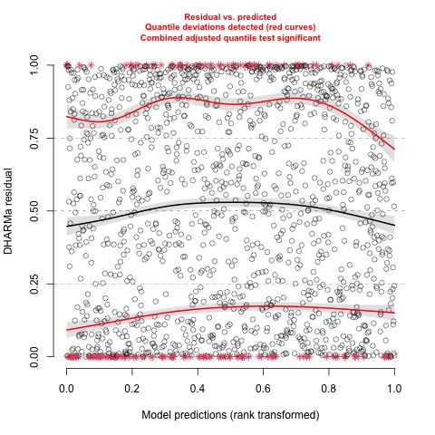{width=70%}  |  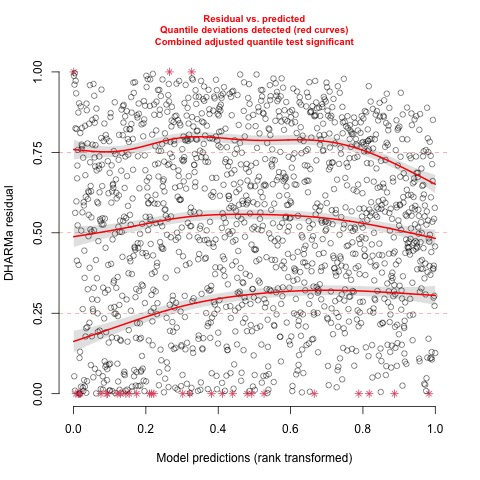{width=70%}
# 
# Poisson qqplot           |  NB qqplot
# :-------------------------:|:-------------------------:
# 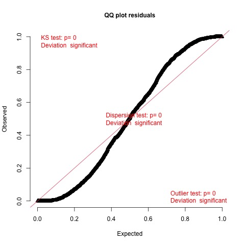{width=70%}  |  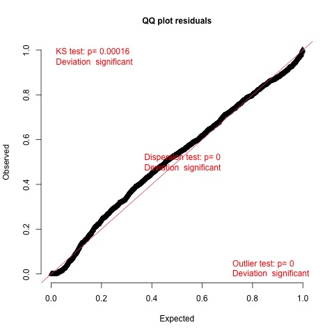{width=70%}
# 


```

Poisson qqplot           |  NB qqplot
:-------------------------:|:-------------------------:
{width=40%}  |  {width=40%}

```{r, include=TRUE}
g1 = modelplot(list(poisson_model_reduced, nb_model_reduced), coef_omit = 'Interc', exponentiate = TRUE) +ggtitle("Poisson vs NB coefficientes") + scale_fill_discrete(labels=c('poisson','nb'))
ggsave("spotifyGLM/plots/poisson_vs_nb.jpeg")

g2 = modelplot(list(coeftest(poisson_model_reduced, vcov = sandwich::vcovHC), coeftest(nb_model_reduced, vcov = sandwich::vcovHC)), coef_omit = 'Interc', exponentiate = TRUE)+ggtitle("Poisson vs NB coefficientes (sandwich)") + scale_fill_discrete(labels=c('poisson','nb'))
ggsave("spotifyGLM/plots/poisson_vs_nb_vcov.jpeg")

```
Let's compare the coefficients and their CI's of the poisson and the negative-binomial:

Poisson vs NB coefficientes         |  Poisson vs NB coefficientes(sandwich estimators)
:-------------------------:|:-------------------------:
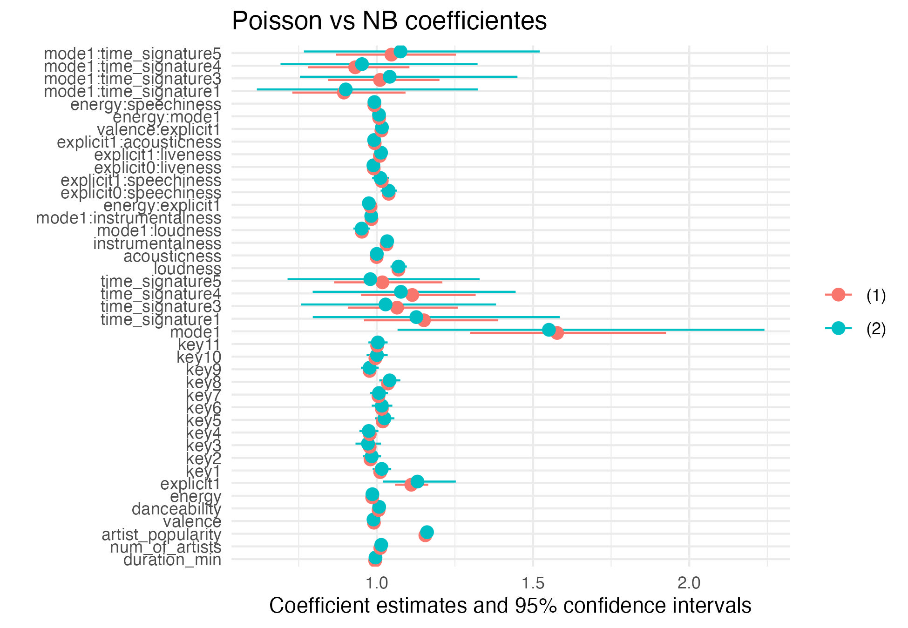{width=60%}  |  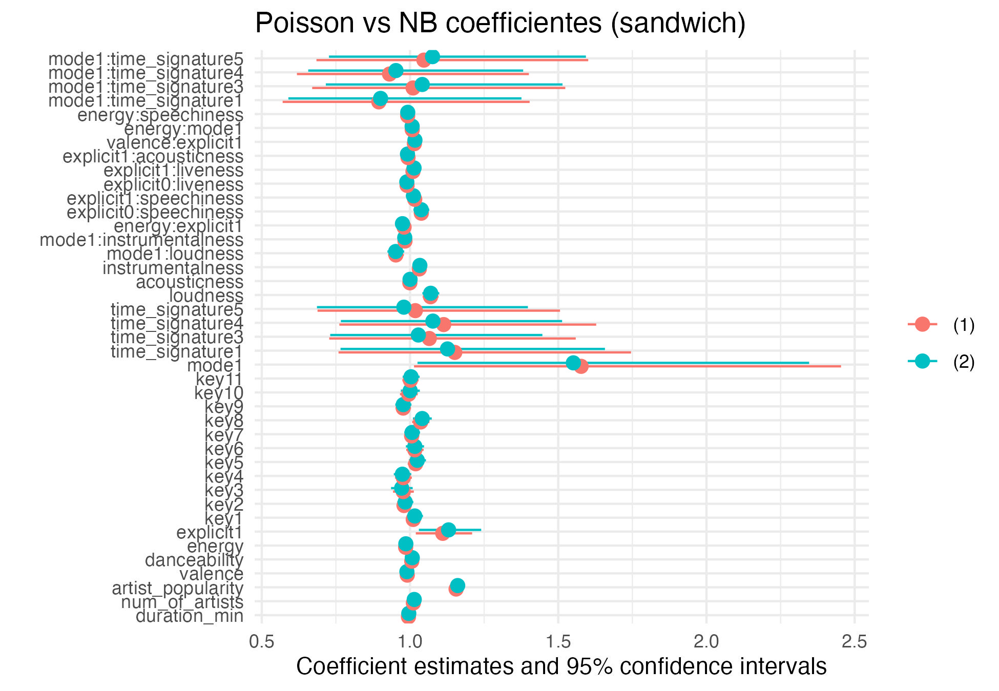{width=60%}


```{r, include=FALSE, results='asis'}
library(stargazer)
lm_model <- lm(formula = formula_3_reduced, data=df_only_popular)
stargazer( nb_model_reduced, lm_model, type="text",header=FALSE, single.row = TRUE, 

          no.space = TRUE, # to remove the spaces after each line of coefficients

          column.sep.width = "3pt", # to reduce column width

          font.size = "tiny", column.labels = c("Poisson", "NB", "LM") )
```

First, seems that the estimates for both of the models are pretty much the same (with slight difference in some of the coefficients). Interestingly, when we are not using robust standart errors, the CI of the poisson coefficients are much smaller than the NB model. But when we are using robust standart error, the CI becomes much bigger.


Let's take a look on the pearson residuals for both models:
```{r, include =FALSE}

data <- data.frame(
  model = rep(c("Poisson", "Negative Binomial"), each = length(resid(poisson_model_reduced))),
  fitted = c(fitted(poisson_model_reduced), fitted(nb_model_reduced)),
  residuals = c(resid(poisson_model_reduced, type = "pearson"), resid(nb_model_reduced, type = "pearson"))
)

# Create the ggplot
gg <- ggplot(data, aes(x = fitted, y = residuals, color = model)) +
  geom_point() +
  scale_color_manual(values = c("blue", "green")) +
  labs(
    x = "Fitted Values",
    y = "Residuals (pearson)",
    title = "Residuals vs Fitted",
    color = "Model"
  )

ggsave("spotifyGLM/plots/residuals_nb_poiss.jpeg")

```

```{r residuals_nb_poisson, echo=FALSE, out.width = '60%', include=TRUE, fig.align = 'center'}
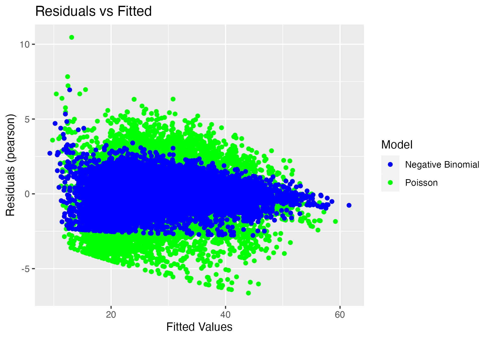
```
The first thing you can see is that the residuals for the Poisson model are larger than the residuals for the NB model. This means that the NB model is more flexible and can fit the data better than the Poisson model.

You can also see that the residuals for the Poisson model are more spread out than the residuals for the Poisson model. This is because the Poisson model allows for overdispersion, which means that the variance of the data is greater than the mean. The NB model does not allow for overdispersion, so the residuals for the NB model are more tightly clustered around zero.

Finally, you can see that there are some outliers in the residuals for both models. Seems like both models have problem with prediction of low-popularity songs, and are much better for prediction of high-popular songs.

Let's take a look on our worst predicted popularity's:

```{r}
# Assuming you have df_only_popular and nb_model_reduced already defined

predictions <- predict(nb_model_reduced, newdata = df_only_popular, type = "response")
df_only_popular$absolute_diff <- abs(predictions - df_only_popular$popularity)

# Calculate z-scores for absolute differences
mean_diff <- mean(df_only_popular$absolute_diff)
sd_diff <- sd(df_only_popular$absolute_diff)
df_only_popular$z_scores <- (df_only_popular$absolute_diff - mean_diff) / sd_diff

# Identify outlines using z-scores
outliers <- which(abs(df_only_popular$z_scores) > 4)

df_only_popular$outliers_zscore <- FALSE
df_only_popular$outliers_zscore[outliers] <- TRUE

# Create the ggplot visualization

gg <- ggplot(df_only_popular, aes(x = predictions, y = popularity, col = outliers_zscore)) +
  geom_point() +
  ggtitle("Outliers") +
  scale_color_manual(values = c("black", "red"))

ggsave("spotifyGLM/plots/outliersNB.jpeg")

```

```{r outliersNB.jpeg, echo=FALSE, out.width = '50%', include=TRUE, fig.align = 'center'}
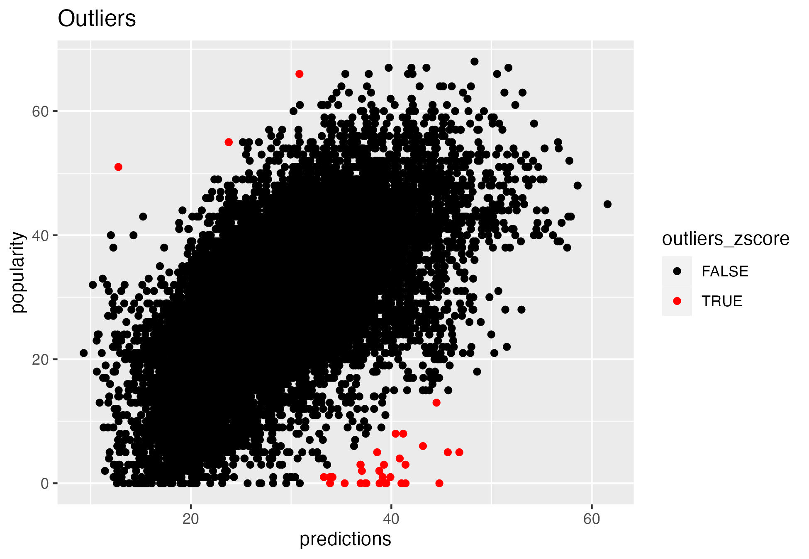
```


```{r, include=TRUE}
df_only_popular$predictions <- predictions
res <- df_only_popular[df_only_popular$outliers_zscore,c("name","artists","popularity","predictions", "z_scores")] %>% arrange(-z_scores) %>% dplyr::select(name,artists,popularity,predictions)  %>% head(10)
knitr::kable(res) %>% kable_styling(font_size = 4) %>% kable_paper(full_width=FALSE)

```
Most of outliers are over-estimate (predicted higher). most of them are remastered, which means are quite old songs that in those year uploaded to Spotify (pink Floyd, David Bowie). A good future features is to get the real release date of the songs.


### Logistic model

```{r models logistic}


formula_1_log <- as.formula(paste("is_popular ~ ", formula_1_))
formula_2_log <- as.formula(paste("is_popular ~ ", formula_2_))
formula_3_log <- as.formula(paste("is_popular ~ ", formula_3_))
formulas_log <- c(formula_1_log, formula_2_log,formula_3_log)
logistic_models <- c()
for (f in formulas_log){
  
  logistic_model <- glm(data = df, formula = f,family = binomial(link="logit"))  
  
  
  nb_models <- c(nb_models, list(nb_model))
  poisson_models <- c(poisson_models, list(poisson_model))
  logistic_models <- c(logistic_models, list(logistic_model))
}


```

```{r, eval=FALSE}
comparison_df_logit_models <- calculate_comparison_df(logistic_models, "logistic_model")
comparison_df_logit_models
```

```{r}


logistic_model <- logistic_models[[3]]
step <- stepCriterion(logistic_model, criterion="p-value", direction="backward", test="lr",  levels = c(0.01, 0.01))
formula_3_reduced_logistic = paste("is_popular ",step$final," - time_signature")
logistic_model_reduced <- glm(data=df, formula=formula_3_reduced_logistic, family = binomial)

```

Also here, the more complex the model is, we get better metrics.

```{r}
anova(logistic_models[[2]],logistic_models[[3]], test = "LRT")

```
```{r}
anova(logistic_model, logistic_model_reduced, test="LRT")
```
This time, the backward elimination have reduced the model more significantly, Removing tempo, mode:time_signature, energy:speechiness from the model.

I've also removed the time signature feature which had very high p value (>0.97) and very high estimates making the model unstable. This probably caused by outliers (most of our data is time_signature = 4 or 3).

```{r, cache=FALSE}
library(equatiomatic)
eq_str_log = extract_eq(logistic_model_reduced,wrap = TRUE, terms_per_line = 5, use_coefs = FALSE)

```

The selected model is as follows:

$$
\begin{aligned}
\log\left[ \frac { P( \operatorname{is\_popular} = \operatorname{TRUE} ) }{ 1 - P( \operatorname{is\_popular} = \operatorname{TRUE} ) } \right] &= \alpha + \beta_{1}(\operatorname{duration\_min}) + \beta_{2}(\operatorname{num\_of\_artists}) + \beta_{3}(\operatorname{artist\_popularity}) + \beta_{4}(\operatorname{valence})\ + \\
&\quad \beta_{5}(\operatorname{danceability}) + \beta_{6}(\operatorname{energy}) + \beta_{7}(\operatorname{explicit}_{\operatorname{1}}) + .....
\end{aligned}
$$


```{r, include=TRUE, results='asis'}
library(stargazer)

stargazer(logistic_model_reduced, type="latex",header=FALSE, single.row = TRUE, 

          no.space = TRUE, # to remove the spaces after each line of coefficients

          column.sep.width = "3pt", # to reduce column width

          font.size = "tiny")
```


The explicit and mode are strong in this model. 

```{r, include=TRUE}

library(stats)
library(pROC)


# Fit the logistic model with different link functions
link_functions <- c("logit", "probit", "cloglog")
models_link_binomial <- list()

for (link in link_functions) {
  model <- glm(formula_3_reduced_logistic, data = df, family = binomial(link = link))
  models_link_binomial[[link]] <- model
}

# Compare ROC curves and AUC
roc_data <- data.frame()

for (link in link_functions) {
  model <- models_link_binomial[[link]]
  roc_obj <- roc(df$is_popular, model$fitted.values)
}

compareBinomial = compareGLM(models_link_binomial[[1]],models_link_binomial[[2]],models_link_binomial[[3]])[[2]]
compareBinomial$link = link_functions
compareBinomial$deviance = c(models_link_binomial[[1]]$deviance,models_link_binomial[[2]]$deviance,models_link_binomial[[3]]$deviance)
kable(compareBinomial[,c("link","AIC","BIC","deviance")]) %>% kable_styling(position = "float_left")
```


In terms of AIC and BIC, the logit link is the best one.

```{r, include=TRUE}
library(pROC)
library(ROCR)
library(ggplot2)

# Extract models
logit_ <- models_link_binomial[[1]]
probit_ <- models_link_binomial[[2]]
cloglog_ <- models_link_binomial[[3]]

# Calculate predictions of models
pred_logit <- prediction(fitted(logit_), df$is_popular)
pred_probit <- prediction(fitted(probit_), df$is_popular) 
pred_cloglog <- prediction(fitted(cloglog_), df$is_popular)

# Calculate ROC curves
roc_logit <- performance(pred_logit, "tpr", "fpr")
roc_probit <- performance(pred_probit, "tpr", "fpr") 
roc_cloglog <- performance(pred_cloglog, "tpr", "fpr")

# Create data frames for legends
legend_data <- data.frame(
  Model = c("Logit", "Probit", "C-log-log"),
  Color = c("#00AFBB", "#E7B800", "#FC4E07")
)

# Create ggplot object for ROC plot
roc_plot <- ggplot() +
  geom_line(data = data.frame(x = roc_logit@x.values[[1]], y = roc_logit@y.values[[1]]), aes(x = x, y = y, color = "Logit"), size = 1) +
  geom_line(data = data.frame(x = roc_probit@x.values[[1]], y = roc_probit@y.values[[1]]), aes(x = x, y = y, color = "Probit"), size = 1) +
  geom_line(data = data.frame(x = roc_cloglog@x.values[[1]], y = roc_cloglog@y.values[[1]]), aes(x = x, y = y, color = "C-log-log"), size = 1) +
  labs(title = "ROC Plot for Different Link Functions") +
  xlab("False Positive Rate") +
  ylab("True Positive Rate") +
  scale_color_manual(values = legend_data$Color, labels = legend_data$Model) +
  theme_minimal() +
  theme(legend.position = "bottom")

# print(roc_plot)
ggsave("spotifyGLM/plots/roc_plot.jpeg")

```
The ROC plot also shows us that the logit link function is the right choice.

```{r roc, echo=FALSE, fig.cap="", out.width = '55%'}
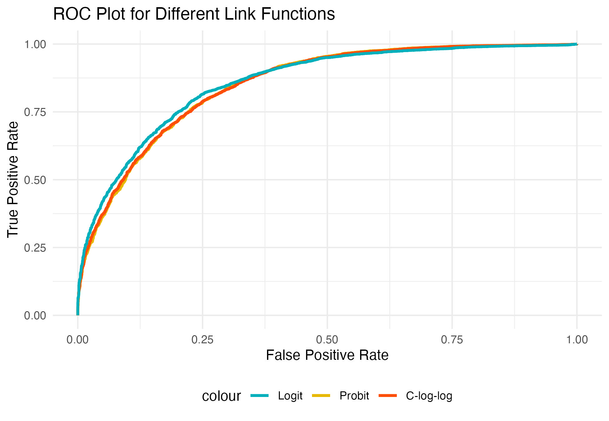

```

```{r, include=FALSE}
library(ggplot2)
library(gridExtra)
resid_logit_resp <- residuals(logistic_model_reduced, type = "response")
resid_logit_dev <- residuals(logistic_model_reduced, type = "deviance")
resid_logit_pear <- residuals(logistic_model_reduced, type = "pearson")


# Create three ggplot objects
g1 <- ggplot(df, aes(x = rownames(df), y = resid_logit_pear)) +
  geom_point( alpha = 0.1) +
  labs(title = "pearson")+  theme(axis.text.x = element_blank(), axis.title.x = element_blank())


g2 <- ggplot(df, aes(x = rownames(df), y = resid_logit_dev)) +
  geom_point( alpha = 0.1) +
  labs(title = "deviance")+  theme(axis.text.x = element_blank(), axis.title.x = element_blank())

g3 <- ggplot(df, aes(x = rownames(df), y = resid_logit_resp)) +
  geom_point( alpha = 0.1) +
  labs(title = "response")+  theme(axis.text.x = element_blank(), axis.title.x = element_blank())

# Arrange the plots using grid.arrange
grid.arrange(g1, g2, g3, ncol = 3, top = "Residuals")

```


```{r}
nb_logistic_formula = glm.nb(data=df, formula=formula_3_reduced_logistic)

```


### GMM 


```{r}
df_filtered <- df %>%
  group_by(artists) %>%
  filter(n() > 3)

```


```{r, eval=FALSE}
library(lme4)
logistic_model <- glm(data=df_filtered, formula=formula_3_reduced_logistic, family = binomial)
formula_logistic_glmm <- "is_popular  ~ (1|artists) +duration_min + num_of_artists + artist_popularity + valence + danceability + energy + explicit + key + mode + time_signature + loudness + acousticness + instrumentalness + mode:loudness + mode:instrumentalness + energy:explicit + explicit:speechiness + explicit:liveness + explicit:acousticness + valence:explicit + energy:mode  - time_signature"
glmm_logistic <- glmer(formula = formula_logistic_glmm, family = binomial, data = df_filtered)
save(glmm_logistic, file = "spotifyGLM/plots/glmm.RData")

```
```{r}
load("spotifyGLM/plots/glmm.RData")
```


```{r, include=TRUE}
stargazer(glmm_logistic, logistic_model,type = "text",header=FALSE, single.row = TRUE, 

          no.space = TRUE, # to remove the spaces after each line of coefficients

          column.sep.width = "3pt", # to reduce column width

          font.size = "tiny")
```

First of all, the LRT test shows that the glmm model have significant better fit ($\chi^2_{stat} = 2841.3$)
The coeffecients estimates and signficance has changed drmaticly with comparison to the new glmm model.
There are some coefficients with opposites estimates (GLM positive estimate, GLMM negative estimate), when looking into those coeffecients, it seems like there are problaby alot of noise, because the significance is not high, and the estimate is pretty small.
Another interesting metric that i thougt of is to compare the ranking of the absulute value of the coeffecients.
The intercept of the models is different, yielding different interaction between the coeffecietns, ive tried to reduce this complexity by plotting the ranking of the coeffeceintes of the model.


```{r, include=TRUE}

library(tidyverse)

# Function to compare coefficient rankings between two models
compare_coefficient_rankings <- function(model1, model2, significance_by, title) {
  # Extract and tidy the coefficient information
  coef_1 <- data.frame(summary(model1)$coefficient)
  coef_2 <- data.frame(summary(model2)$coefficient)
  
  
  # Rank coefficients based on the absolute value of estimates for each model
  coef_1 <- arrange(coef_1, desc(abs(Estimate))) %>%
    mutate(rank_1 = 1:nrow(coef_1))
  
  coef_2 <- arrange(coef_2, desc(abs(Estimate))) %>%
    mutate(rank_2 = 1:nrow(coef_2))
  # Merge the ranked coefficients from both models based on the coefficient names
  matched_coefs <- merge(coef_1,coef_2, by = 0, all = TRUE)  # 'by = 0' means merge by the row names
  colnames(matched_coefs)[1] <- "term"

  
   # Create a dataframe for comparison
  comparison_df <- data.frame(
    coefficient = matched_coefs$term,
    rank_1 = matched_coefs$rank_1,
    rank_2 = matched_coefs$rank_2
  )
  if (significance_by == "a") {
    comparison_df$significance = ifelse(matched_coefs$Pr...z...x < 0.01, "Significant", "Not Significant")
  }
  else {
    comparison_df$significance = ifelse(matched_coefs$Pr...z...y < 0.01, "Significant", "Not Significant")
  }
  correlation <- cor(comparison_df$rank_1, comparison_df$rank_2, method = "spearman")
  
  # Create a ggplot graph for visualization
  comparison_plot <- ggplot(comparison_df, aes(x = rank_1, y = rank_2, color = significance, label = coefficient)) +
    geom_point() +
    geom_abline(intercept = 0, slope = 1, color = "red", linetype = "dashed") +
    geom_text(nudge_x = 0.5, nudge_y = -0.5, size = 2) +  # Add coefficient labels with nudge adjustments
    labs(x = "Logistic Rank", y = "GLMM logistic Rank", title = title )+
    scale_color_manual(values = c("Significant" = "green", "Not Significant" = "gray")) +
    theme_minimal()
  
  # Show the graph
  return(comparison_plot)
}
g1 = compare_coefficient_rankings(logistic_model, glmm_logistic, significance_by= "a", title="Signifcance by GLM")
g2 = compare_coefficient_rankings(logistic_model, glmm_logistic, significance_by= "b", title="Signifcance by GLMM")
grid.arrange(g1,g2,top="dfs")
```

Overall, the inclusion of artist clusters in the GLMM seems to lead to changes in the magnitude and sometimes the direction of the coefficients, indicating that accounting for the random effects associated with artists can have a substantial impact on the interpretation of the relationships between predictor variables and popularity.

## Summary
In this analysis of the Spotify dataset, the goal was to model the relationship between various features and the popularity of songs using different Generalized Linear Models (GLMs). The chosen response variable, popularity, is a count data and discrete, making the Poisson model an initial suitable choice due to its simplicity and compatibility with count data. However, issues of over-dispersion arose, suggesting that the Poisson model might not be the best fit.

The Likelihood Ratio Test (LRT) indicated that a more complex model was superior, yet its complexity led to the exploration of a leaner model. Through backward elimination, the tempo feature was removed. The LRT between the reduced model and the initial complex model suggested that removing the tempo feature was reasonable. In terms of complexity, the selected model is still pretty big, and for further analysis, i can try to reduce the size of the model with more 'strong' backward elimination (controlling with higher p-value), or with trying to remove high correlated features.

The final model was defined, and its metrics were evaluated: AIC, BIC, and deviance were provided for model comparison. The model's coefficients were analyzed, revealing the significance and strength of various covariates. 
Mode: Songs in major mode are more likely to be popular. This is probably because they are perceived as being happier and more upbeat.
Artist popularity: Songs by more popular artists are more likely to be popular. This is probably because more people are familiar with the artist and are more likely to listen to their songs.
Explicit: Explicit songs are more likely to be popular. This is probably because they are more exciting and attention-grabbing.

Our results also suggest that some factors, such as key and time signature, which not have a significant impact on song popularity. This is interesting, as these factors are often thought to be important in music theory, i suspect that there is not enough data for the variablity of this factors.


Accounting for over-dispersion, a Negative-Binomial model was considered. Although similar to the Poisson model, the Negative-Binomial model appeared to provide better fit as demonstrated by residual analysis and the ability to handle over-dispersion. Coefficient estimates between the two models were largely consistent, with the Negative-Binomial model exhibiting wider confidence intervals, particularly when robust standard errors were applied (sandwich estimators).

The Logistic model was also explored with the same formulas, the backward elimination procedure assisted in constructing a smaller and more interpretable model. The logit link function was deemed optimal in terms of AIC and BIC.
Except from the strong and significant coefficients from the NB model, in this model there were a few more interesting coefficients that arose like:
energy:explicit -  Negative estimate which probably means that songs with low energy and no explicit tend to be less popular.
num_of_Artist - Negative estimate, probably there are alot of unpopular songs with alot of artists in the same song.
However, comparison between regression and classification models are pretty problematic (in addition to that, this is not extacly the same data).

In regular linear regression, the assumptions are pretty strict with (P=Gaussian) and identity link. With GLM, we can match the problem we are trying to solve to our GLM, while while adjusting the underlying assumptions (distribution, link function) to our specific probelm. 


In conclusion, this analysis demonstrated the importance of model selection and validation in GLMs. The Poisson model, despite its initial suitability for count data, faced challenges of over-dispersion, leading to the consideration of more complex models and the Negative-Binomial model to account for over-dispersion. The ultimate choice of model, whether Poisson, Negative-Binomial, or Logistic, was determined by considerations of goodness-of-fit, feature significance, and model stability.


Further Research and Ideas: \

1. Offset - Poisson regression is typically used to model count data. But, sometimes, it is more relevant to model rates instead of counts. This is relevant when, e.g., individuals are not followed the same amount of time. We can use offset here with using the datetime (month). we can account for this temporal variability and potentially yield more accurate results.

2. Confounding and collapsible - Exploring the impact of confounding variables and collapsibility in the context of the GLM analysis could offer valuable insights. Investigating how certain variables might confound the relationships between features and song popularity could help refine the model and enhance its explanatory power. Additionally, examining the collapsibility of associations between variables might shed light on the underlying causal mechanisms.

3. GLMM - Extending the analysis to include Generalized Linear Mixed Models (GLMMs) could be a promising avenue. GLMMs allow for the incorporation of both fixed and random effects, accommodating complex hierarchical structures in the data. In the context of song popularity, this could account for potential clustering of songs within artists, genres, or other categorical variables.

4. comparison with lm model - Performing a comprehensive comparison between the GLM models and a traditional linear regression (lm) model could provide interesting insights. While the GLM models are tailored to handle specific data distributions and link functions, a linear regression model could offer a benchmark for understanding how well the GLMs capture the underlying relationships. This comparison might highlight instances where the specialized nature of GLMs leads to better fit and interpretability.

5. Try different data - see if the conclusions here can be generlized to different time period.


## Appendix
### Features description
**artists**: The artists' names who performed the track (can be more than one). \
**track_name**: Name of the track. \
**duration_ms**: The track length in milliseconds. \
**explicit**: Whether or not the track has explicit lyrics. \
**danceability**: Danceability describes how suitable a track is for dancing based on a combination of musical elements. \
**energy**: Energy represents a perceptual measure of intensity and activity. Typically, energetic tracks feel fast, loud, and noisy. \
**key**: The key the track is in. Integers map to pitches using standard Pitch Class notation. \
**loudness**: The overall loudness of a track in decibels (dB). \
**mode**: Mode indicates the modality (major or minor) of a track, the type of scale from which its melodic content is derived. Major is represented by 1 and minor is 0. \
**Artist_popularity**: How popular is the artist. \
**Genre**: Genre of this particular artist (I took a random genre because each artist has multiple genres). \
**speechiness**: Speechiness detects the presence of spoken words in a track. \
**acousticness**: A confidence measure from 0.0 to 1.0 of whether the track is acoustic. 1.0 represents high confidence the track is acoustic. \
**instrumentalness**: Predicts whether a track contains no vocals. "Ooh" and "aah" sounds are treated as instrumental in this context. Rap or spoken word tracks are clearly "vocal". The closer the instrumentalness value is to 1.0, the greater likelihood the track contains no vocal content. \
**liveness**: Detects the presence of an audience in the recording. Higher liveness values represent an increased probability that the track was performed live. A value above 0.8 provides a strong likelihood that the track is live. \
**valence**: A measure from 0.0 to 1.0 describing the musical positiveness conveyed by a track. Tracks with high valence sound more positive (e.g., happy, cheerful, euphoric), while tracks with low valence sound more negative (e.g., sad, depressed, angry). \
**tempo**: The overall estimated tempo of a track in beats per minute (BPM). In musical terminology, tempo is the speed or pace of a given piece and derives directly from the average beat duration. \
**time_signature**: An estimated time signature. The time signature (meter) is a notational convention to specify how many beats are in each bar (or measure). The time signature ranges from 3 to 7, indicating time signatures from 3/4 to 7/4. \
**track_genre**: The genre in which the track belongs. \


2. code (organized) (include the jupyter notebook as well)

## Refernces